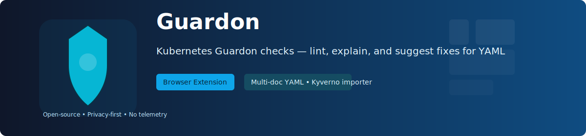
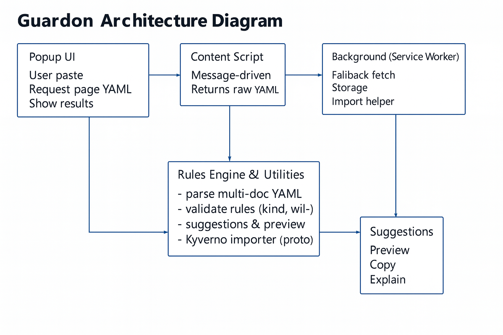

# 🛡️ Guardon — Kubernetes Compliance & Security Checks Extension



[Open product banner (raw SVG)](./assets/product-banner.svg)

Guardon is a lightweight browser extension that helps developers and reviewers detect common Kubernetes misconfigurations and security issues directly on code hosting sites (GitHub, GitLab, Bitbucket) or from pasted YAML. It parses multi-document YAML, applies configurable rules, and can suggest safe fixes.
Quick Introduction : https://youtu.be/LPAi8UY1XIM

This README documents installation, development, configuration, and how to contribute to the project.

## Key features

- Validate Kubernetes YAML (multi-document) in the browser popup.
- Rule engine with:
  - Pattern checks (regex) and per-element wildcard support (containers[*].image)
  - Required-field checks with per-element reporting
  - Kind-based filtering (comma-separated, case-insensitive)
  - Optional fix suggestion metadata (preview & copy patched YAML)
- Kyverno policy importer (prototype) — converts simple Kyverno validate patterns into internal rules and preserves raw policies for audit.
- Explain button: attach rationale and external references (CIS, NIST, Kyverno) to rules and surface them in the popup.
- Safe content-script behavior: non-invasive (no auto-injection); validation happens on explicit action (popup) or manual paste.
- Background fetch helper for importing remote rule files or raw YAML from hosts like raw.githubusercontent.com.
- Dark Theme

## Quick Demo
 - https://youtu.be/b-kzvAfV5r8

## Quick install (developer / local)

1. Clone the repository:

  git clone https://github.com/<owner>/guardon.git
  cd guardon

2. Developer prerequisites

   - Node.js >= 16 (for running tests)
   - npm (bundled with Node)

3. Install dependencies (for tests & local tooling):

   ```powershell
   npm install
   ```

4. Load extension into Chrome (unpacked):

   - Open `chrome://extensions`
   - Enable **Developer mode**
   - Click **Load unpacked** and select this repository folder

Note: The extension uses a UMD `js-yaml` bundle for content scripts and popup, which is provided in `src/lib/js-yaml.min.js`. Node tests import the npm `js-yaml` package.

## Usage

- Open the popup on a page containing Kubernetes YAML (e.g., a GitHub blob). The popup tries messaging the content script, then falls back to fetching raw content (GitHub raw), and finally executeScript extraction.
- If YAML is found, the extension validates it and shows violations grouped by severity. Click items for suggested actions.
- If no YAML is detected, paste YAML manually in the popup and click Validate.

Popup actions per violation:

- Preview patch (🔧): Generate a patched YAML preview for the suggested fix.
- Copy snippet (📋): Copy only the snippet/value recommended by the fix.
- Explain (ℹ️): Show the rule rationale and reference links (CIS/NIST/Kyverno docs or internal links).

## Rules & Options

- Rules are stored in extension storage and editable via the Options page (`src/options/options.html`).
- Rule schema (important fields):

  - id: unique rule identifier
  - description: human description
  - kind: optional comma-separated kinds to scope the rule
  - match: dot/array path to inspect (supports `[*]` for arrays)
  - pattern: a JavaScript RegExp string to evaluate against the target value
  - required: boolean — mark field as required
  - severity: `info` | `warning` | `error`
  - fix: optional JSON describing a suggested fix (action/value/hint)
  - explain: optional object { rationale: string, refs: string[] }

- Options page features:
  - Add/Edit/Delete rules
  - Import from file or URL (background fetch fallback)
  - Kyverno policy detection + preview of converted rules
  - Import panel buttons: "Paste from clipboard" and "Cancel" (convenience and clear/close the import UI)
  - Quick "Suggest resource fix" helper to populate the Fix JSON textarea with a sensible requests/limits suggestion for resource-related rules

## Kyverno importer (prototype)

- Located at `src/utils/kyvernoImporter.js`.
 
## Governance & Maintainers

This project follows a minimal governance model appropriate for early-stage projects. See `GOVERNANCE.md` for details on decision-making, releases, and how to become a maintainer. The current maintainers are listed in `MAINTAINERS.md`. See `ROADMAP.md` for planned features, milestones, and time horizons.

If you are contributing, please read `CONTRIBUTING.md` and follow the Developer Certificate of Origin (DCO) process described there.

 - Preview and import behavior:
   - When a Kyverno policy is detected during import-from-URL, the Options page shows a preview modal for converted rules.
   - If the converter produces zero convertible rules, the UI now surfaces a toast and console.debug message explaining that no convertible rules were produced (the raw policy can still be stored for audit).
   - The preview modal supports selecting converted rules and importing them; imported rules will overwrite existing rules with the same `id`.

## Architecture



High-level architecture:

- Popup UI: user-triggered validation, YAML paste, and results/suggestions UI.
- Content script: message-driven page extractor that returns raw YAML when requested by the popup.
- Background (service worker): performs fallback fetches (raw content, import-from-URL), accesses storage.
- Rules engine & utilities: multi-doc YAML parsing, rule evaluation (kind filtering, wildcard per-element checks), suggestion generation and preview helpers, and Kyverno importer.

This diagram shows the main data flow: the popup requests YAML from the content script (or falls back to background fetch), sends YAML to the rules engine for validation, and displays violations and optional fix suggestions to the user.
- Detects Kyverno Policy manifests (apiVersion contains `kyverno.io` and kind Policy/ClusterPolicy).
- Converts simple `validate.pattern` leaves into required checks and pattern-based rules. Also detects common env `name`/`value` entries and converts negative checks (`!value`) into pattern rules with sibling conditions.
- Converted rules are previewed in the Options page; you can import converted rules or store raw Kyverno policies for audit.

Limitations: the importer is heuristic and intentionally conservative — complex policies are not fully converted and are left for manual review.

## Development & tests

- Run unit tests and collect coverage (requires dependencies installed):

  ```powershell
  npm install
  npm test
  ```

- Tests use Jest and target utility modules under `src/utils`. Coverage reports are stored in `coverage/`.

## Building the distribution ZIP (for Chrome Web Store)

We provide small scripts that create a trimmed ZIP containing only the runtime files needed by the extension (manifest, popup/options, background, content script, runtime libs). Use these to produce the ZIP you upload to the Chrome Web Store.

PowerShell (Windows):

```powershell
# from repository root
.\scripts\build-dist.ps1
# or specify a custom filename
.\scripts\build-dist.ps1 -OutFile guardon-latest.zip
```

Bash (Linux/macOS/WSL):

```bash
chmod +x ./scripts/build-dist.sh
./scripts/build-dist.sh
# or with explicit output name
./scripts/build-dist.sh guardon-latest.zip
```

Quick checks:

- List files in the zip (bash):

```bash
unzip -l guardon-*.zip
```

- Inspect contents (PowerShell):

```powershell
# unzip to a temporary folder and list
Expand-Archive -LiteralPath .\guardon-*.zip -DestinationPath .\tmp-dist -Force
Get-ChildItem -Path .\tmp-dist -Recurse
```

Optional validation:

- Ensure manifest-referenced files exist in the zip (simple grep/unzip approach):

```bash
unzip -l guardon-*.zip | awk '{print $4}' | grep -E 'manifest.json|src/popup/popup.html|src/options/options.html|src/background.js' || echo "missing file(s)"
```


If `npm install` fails, please check your Node/npm versions and network connectivity. Share the npm error output if you need help troubleshooting.

## Architecture notes

- rulesEngine: `src/utils/rulesEngine.js` — core validation engine. Exports `validateYaml`, `previewPatchedYaml` and helpers. Designed to run in both browser (with UMD js-yaml) and Node (npm js-yaml).
- kyvernoImporter: `src/utils/kyvernoImporter.js` — converts Kyverno patterns to internal rules.
 - options UI: `src/options/options.html` and `src/options/options.js` — the Options page includes the Kyverno preview modal, import panel (paste/cancel), a suggest-fix helper, and the import logic that merges or replaces rules by id.
- content scripts: minimal and message-driven — they avoid DOM mutations on load.
- background service worker: provides a `FETCH_RAW` helper for CORS/raw fetching.

## Contributing

- Bug reports and pull requests are welcome. Please follow these guidelines:
  1. Open an issue describing the bug or feature.
  2. Create a branch: `git checkout -b feature/your-feature`.
  3. Add tests for new behavior where applicable.
  4. Keep changes focused and unit-tested.

- Coding style: follow existing project patterns (plain JS, minimal dependencies). Aim for readable, defensive code in utility modules.

## Security / Responsible disclosure

- Do not include secrets in rules or in commits. If you discover a security issue, open a private issue or contact the maintainers so we can address it promptly.

## Troubleshooting

- Popup shows "Validation engine not available": open DevTools for the popup and check console for module import or js-yaml errors.
- Suggestions not appearing: ensure rules saved in Options include `fix` and `explain` metadata; open DevTools and inspect `chrome.storage.local.get('customRules', ...)` to verify.
- `npm install` fails: check Node version (`node -v`) and npm error logs (share them for help).

## License

Apache-2.0 — see the LICENSE file.

## Contact

If you'd like help adapting this extension to your org's policies or adding automatic PR patching, open an issue or create a discussion thread in the repository.
